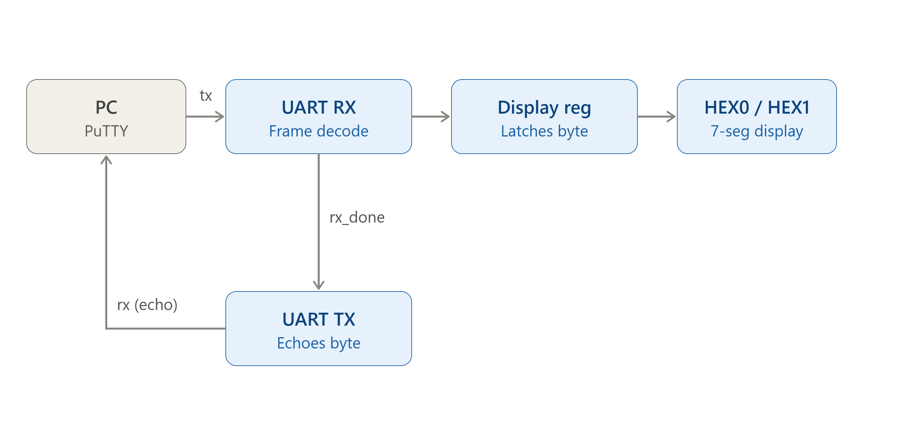
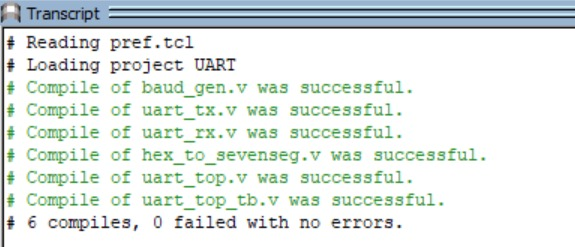
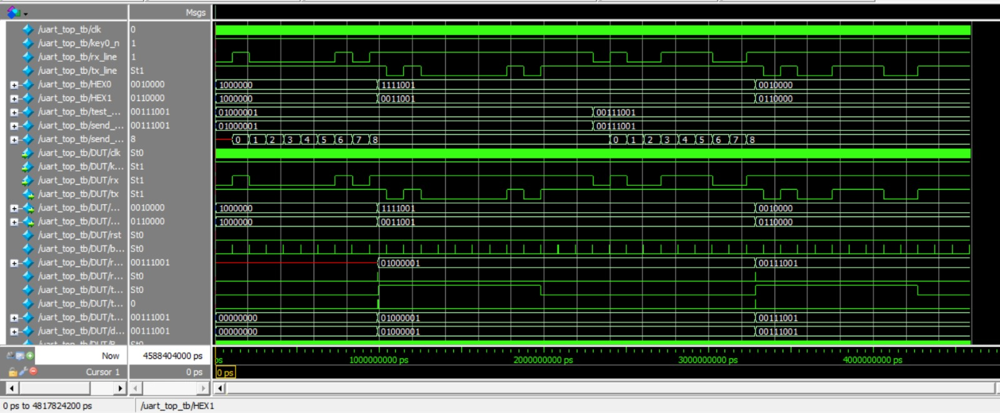
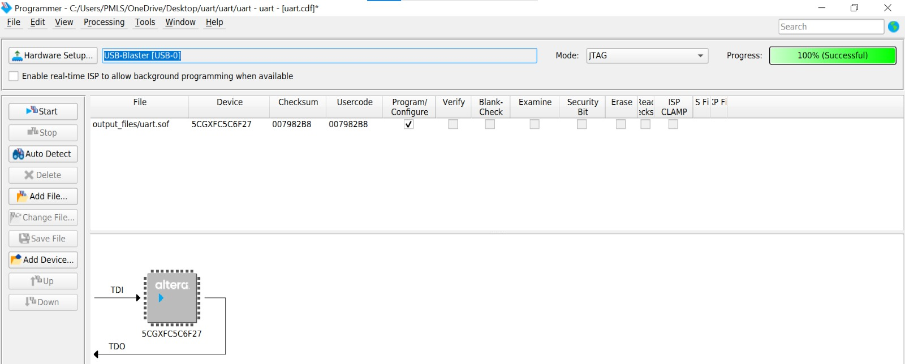

# UART Core for PC–FPGA Communication

A UART (Universal Asynchronous Receiver/Transmitter) core implementing full-duplex serial communication between a PC and an FPGA, with received data displayed on dual 7-segment displays and an echo/bounce-back mechanism for transmission confirmation.

**Target Board:** Terasic Cyclone V GX Starter Kit (5CGXFC5C6F27C7)
**Tool:** Intel Quartus Prime Lite

---

## Features

- Custom UART Transmitter and Receiver (no IP catalog / no vendor macros)
- Configurable baud rate generator (default: 9600 bps, 50 MHz system clock)
- 8N1 frame format (8 data bits, no parity, 1 stop bit)
- Mid-bit sampling on RX for noise immunity
- **Echo/bounce-back**: every byte received from the PC is immediately retransmitted back, allowing the sender to confirm the exact byte the FPGA received
- Received byte displayed live on two 7-segment displays (HEX0 = lower nibble, HEX1 = upper nibble)
- Verified in **ModelSim** simulation with a self-checking testbench
- Synthesized and compiled cleanly in Quartus Prime with verified pin assignments from the official board manual
- Tested on real hardware via PuTTY serial terminal

---

## Architecture





## Repository Structure

```
UART/
├── rtl/
│   ├── uart_top.v              # Top-level: instantiation + echo logic + reset inversion
│   ├── uart_rx.v               # UART receiver FSM (mid-bit sampling)
│   ├── uart_tx.v                # UART transmitter FSM
│   ├── hex_to_sevenseg.v        # 4-bit hex nibble -> active-low 7-seg decoder
│   └── baud_gen.v               # Clock divider — 50 MHz -> baud tick
├── sim/
│   └── uart_top_tb.v            # Self-checking testbench (simulated PC->FPGA byte transfer)
├── constraints/
│   ├── UART.qpf                 # Quartus project file
│   ├── UART.qsf                 # Pin assignments (verified from Terasic C5G user manual)
│   └── UART.sdc                 # Timing constraint (50 MHz clock)
├── results/
│       ├── modelsim_compilation.jpeg           # ModelSim compile log
│       ├── modelsim_waveform.jpeg              # ModelSim simulation waveform
│       ├── quartus_programmer_success.jpeg     # Quartus programmer success
        └── uart_architecture_diagram.png
└── README.md
```

---

## Design Specifications

| Parameter | Value |
|---|---|
| System Clock | 50 MHz (onboard fixed oscillator) |
| Baud Rate | 9600 bps |
| Data Format | 8N1 |
| Display | 2-digit hex (HEX0 = lower nibble, HEX1 = upper nibble) |
| Reset | KEY0 push button (active-low), inverted internally to active-high |

### Top-Level Ports
```verilog
module uart_top (
    input  wire       clk,
    input  wire       key0_n,   // active-low reset button
    input  wire       rx,
    output wire        tx,
    output wire [6:0]  HEX0,
    output wire [6:0]  HEX1
);
```

---

## Simulation Results (ModelSim)

The testbench simulates a PC sending bytes `0x41` ('A') and `0x39` ('9') over `rx`, and checks that the correct hex digits appear on HEX0/HEX1, and that the same byte is echoed back on `tx`.

| Byte Sent | HEX1 (upper nibble) | HEX0 (lower nibble) | Result |
|---|---|---|---|
| `0x41` ('A') | `0011001` (expected `0x4`) | `1111001` (expected `0x1`) | ✅ Match |
| `0x39` ('9') | `0110000` (expected `0x3`) | `0010000` (expected `0x9`) | ✅ Match |

`DUT/rst` correctly deasserted once `key0_n = 1`; `tx` toggled after each `rx_done` pulse, confirming echo/bounce-back behavior at the RTL level.
---
Compile log:

 
 ---
Waveform:


---
**Run it yourself (ModelSim):**
```tcl
vlib work
vmap work work
vlog baud_gen.v uart_tx.v uart_rx.v hex_to_sevenseg.v uart_top.v uart_top_tb.v
vsim -voptargs=+acc work.uart_top_tb
add wave -r /*
run -all
```

---

## Quartus Synthesis & Compilation

| Stage | Result |
|---|---|
| Analysis & Synthesis | 0 errors, 3 warnings (harmless bit-width truncation) |
| Fitter | 0 errors — device: 5CGXFC5C6F27C7, 83/29,080 ALMs (<1%), 121 registers, 18/364 pins |
| Assembler | 0 errors — `UART.sof` generated |
| Timing Analyzer | Non-blocking timing notes; resolved by adding `UART.sdc` with a 50 MHz (`20.000 ns`) clock constraint |
---
## Programmer Success

---
### Pin Assignments (verified from official Terasic C5G User Manual)

| Signal | Pin | I/O Standard |
|---|---|---|
| clk | PIN_R20 | 3.3-V LVTTL |
| key0_n | PIN_P11 | 1.2 V |
| rx | PIN_M9 | 2.5 V |
| tx | PIN_L9 | 2.5 V |
| HEX0[0:6] | V19, V18, V17, W18, Y20, Y19, Y18 | 1.2 V |
| HEX1[0:6] | AA18, AD26, AB19, AE26, AE25, AC19, AF24 | 1.2 V |

Full pin assignments: [`constraints/UART.qsf`](constraints/UART.qsf)

---

## Hardware Test (PuTTY)

1. FPGA programmed via **Tools → Programmer** in Quartus using `UART.sof` (USB-Blaster/JTAG)
2. Board's onboard UART-to-USB port connected to the PC
3. COM port identified via Device Manager (FTDI VCP driver)
4. PuTTY opened as a **Serial** connection at **9600 baud** on the identified COM port
5. Characters typed directly into the PuTTY terminal window are sent to the FPGA over UART

**Result:** the FPGA decodes and displays the received byte on HEX0/HEX1, then immediately echoes it back — the same character reappearing in the PuTTY terminal confirms the round-trip (bounce-back).

---

## Status

| Stage | Status |
|---|---|
| RTL Design | ✅ Complete |
| Functional Simulation (ModelSim) | ✅ Verified |
| Quartus Synthesis & Compilation | ✅ 0 errors |
| Pin Assignment | ✅ Complete |
| Hardware Programming & Live Test (PuTTY) | ✅ Verified |

---
